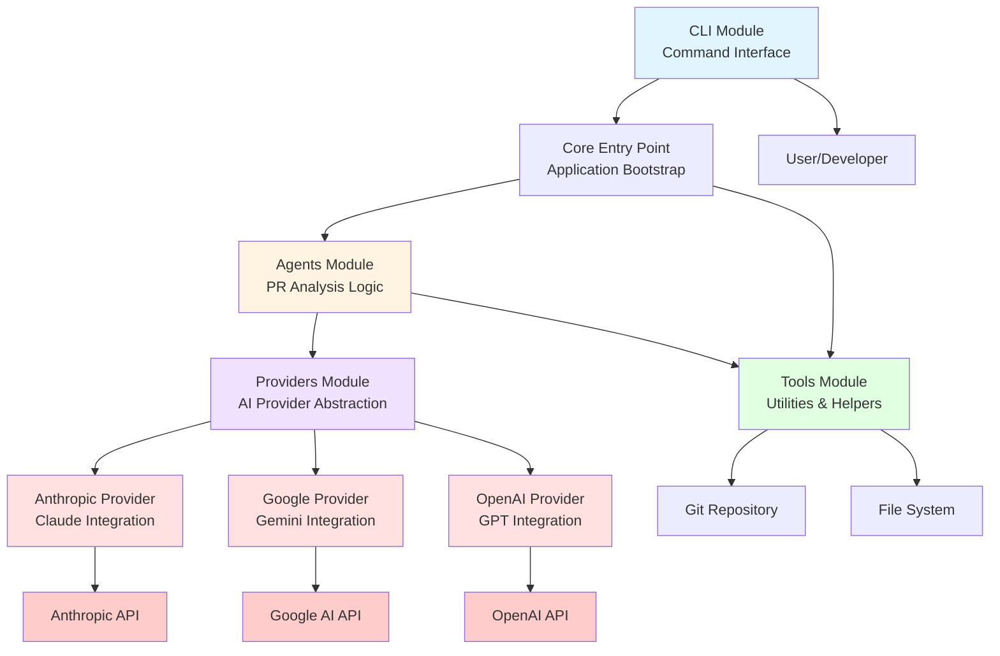

# 🏗️ System Architecture

[← Back to Index](./index.md)

---

## Overview

A modular monolithic CLI application for automated pull request analysis and review using multiple AI providers. The system follows a layered architecture with clear separation between CLI interface, agent orchestration, AI provider abstraction, and utility tools. It implements a provider pattern for multi-LLM support (Anthropic, Google, OpenAI) and uses an agent-based approach for PR analysis workflows.

## Architectural Style

**Style**: modular-monolith

## System Layers

1. Presentation (CLI Interface)
2. Business Logic (Agents & Orchestration)
3. Integration (Provider Abstraction)
4. Infrastructure (Tools & Utilities)

## Main Components

### CLI Module

**Type**: module

Command-line interface entry point for user interactions and command processing

**Responsibilities**:
- Parse command-line arguments and options
- Handle user input validation
- Orchestrate command execution flow
- Display output and error messages to users
- Manage CLI lifecycle and exit codes

**Dependencies**: Agents Module, Providers Module, Tools Module

**Technologies**: TypeScript, Node.js CLI

### Agents Module

**Type**: module

Core business logic for PR analysis workflows and agent orchestration

**Responsibilities**:
- Implement PR review agent logic
- Coordinate multi-step analysis workflows
- Manage agent state and context
- Process PR data and generate insights
- Orchestrate interactions between tools and providers

**Dependencies**: Providers Module, Tools Module

**Technologies**: TypeScript, Agent Pattern

### Providers Module

**Type**: module

Abstraction layer for multiple AI/LLM service providers

**Responsibilities**:
- Define common provider interface
- Abstract provider-specific implementations
- Handle API authentication and configuration
- Manage rate limiting and error handling
- Normalize responses across different providers

**Technologies**: TypeScript, Provider Pattern, Strategy Pattern

### Anthropic Provider

**Type**: service

Integration service for Anthropic Claude AI models

**Responsibilities**:
- Implement Anthropic API client
- Handle Claude-specific request formatting
- Manage Claude model selection and parameters
- Process and normalize Claude responses
- Handle Anthropic-specific error codes

**Dependencies**: Providers Module

**Technologies**: TypeScript, Anthropic API, Claude

### Google Provider

**Type**: service

Integration service for Google AI models (Gemini)

**Responsibilities**:
- Implement Google AI API client
- Handle Gemini-specific request formatting
- Manage Gemini model selection and parameters
- Process and normalize Gemini responses
- Handle Google AI-specific authentication

**Dependencies**: Providers Module

**Technologies**: TypeScript, Google AI API, Gemini

### OpenAI Provider

**Type**: service

Integration service for OpenAI GPT models

**Responsibilities**:
- Implement OpenAI API client
- Handle GPT-specific request formatting
- Manage GPT model selection and parameters
- Process and normalize GPT responses
- Handle OpenAI-specific error codes and rate limits

**Dependencies**: Providers Module

**Technologies**: TypeScript, OpenAI API, GPT

### Tools Module

**Type**: module

Utility functions and helper tools for PR analysis and processing

**Responsibilities**:
- Provide Git operations utilities
- Implement file parsing and diff analysis
- Offer code analysis helpers
- Provide formatting and templating utilities
- Handle data transformation and validation

**Technologies**: TypeScript, Node.js

### Core Entry Point

**Type**: module

Main application entry point and initialization

**Responsibilities**:
- Bootstrap application configuration
- Initialize dependency injection
- Setup global error handlers
- Configure logging and monitoring
- Coordinate module initialization

**Dependencies**: CLI Module, Agents Module, Providers Module, Tools Module

**Technologies**: TypeScript, Node.js

## External Integrations

- Anthropic Claude API
- Google Gemini API
- OpenAI GPT API
- Git Repository Access
- File System
- Environment Configuration

## Architecture Diagram

> 💡 **Tip**: View this diagram with a Mermaid renderer:
> - VS Code: Install "Markdown Preview Mermaid Support" extension
> - GitHub/GitLab: Automatic rendering in markdown preview
> - Online: Copy to [mermaid.live](https://mermaid.live)

📊 Click to view component diagram

## 💡 Key Insights

1. The modular monolithic architecture provides good separation of concerns while maintaining simplicity for a CLI tool, avoiding the overhead of microservices
2. The provider pattern implementation enables easy addition of new AI providers without modifying core agent logic, demonstrating strong adherence to Open/Closed Principle
3. Clear layering between CLI, business logic (agents), integration (providers), and utilities (tools) facilitates testing and maintenance
4. The agent-based approach allows for complex PR analysis workflows to be composed from smaller, reusable components
5. Multiple AI provider support provides redundancy and allows users to choose based on cost, performance, or availability preferences
6. The centralized provider abstraction layer ensures consistent error handling and response normalization across different LLM APIs
7. The modular structure supports incremental feature development and allows individual modules to be tested in isolation
8. The architecture is well-suited for CLI deployment with minimal runtime dependencies and fast startup times
9. The separation of tools module enables reuse of utility functions across different agents and workflows
10. The current structure supports horizontal scaling through parallel PR analysis if needed in future iterations

## 💡 Recommendations

Based on the architectural analysis, consider the following improvements:

- **Address**: No explicit data persistence layer detected - consider adding a repository pattern if PR analysis history or caching is needed
- **Address**: Lack of visible configuration management module may lead to scattered configuration logic across components
- **Address**: No apparent API rate limiting or retry logic abstraction - each provider may implement this differently leading to inconsistent behavior
- **Address**: Missing observability layer - consider adding structured logging, metrics, and tracing for production debugging
- **Address**: No explicit error boundary or circuit breaker pattern visible - cascading failures from provider APIs could impact user experience
- **Address**: Absence of a dedicated testing utilities module may lead to duplicated test setup code across unit tests
- **Address**: No visible authentication/authorization layer - if the tool expands to multi-user scenarios, this will need to be added
- **Address**: Lack of explicit dependency injection container may make testing and mocking more difficult as the application grows
- **Address**: No apparent caching strategy for expensive AI API calls - repeated analysis of same PR could incur unnecessary costs
- **Address**: Missing health check or diagnostic module for troubleshooting provider connectivity issues

## Architecture Metadata

| Property | Value |
|----------|-------|
| **Architecture Style** | modular-monolith |
| **Layers** | Presentation (CLI Interface), Business Logic (Agents & Orchestration), Integration (Provider Abstraction), Infrastructure (Tools & Utilities) |
| **Total Components** | 8 |
| **External Integrations** | Anthropic Claude API, Google Gemini API, OpenAI GPT API, Git Repository Access, File System, Environment Configuration |
| **Analysis Date** | 2025-11-10 |

---

_Architecture analysis completed on 2025-11-10T09:08:29.280Z_

---

[← Back to Index](./index.md) | [Next: File Structure →](./file-structure.md)
