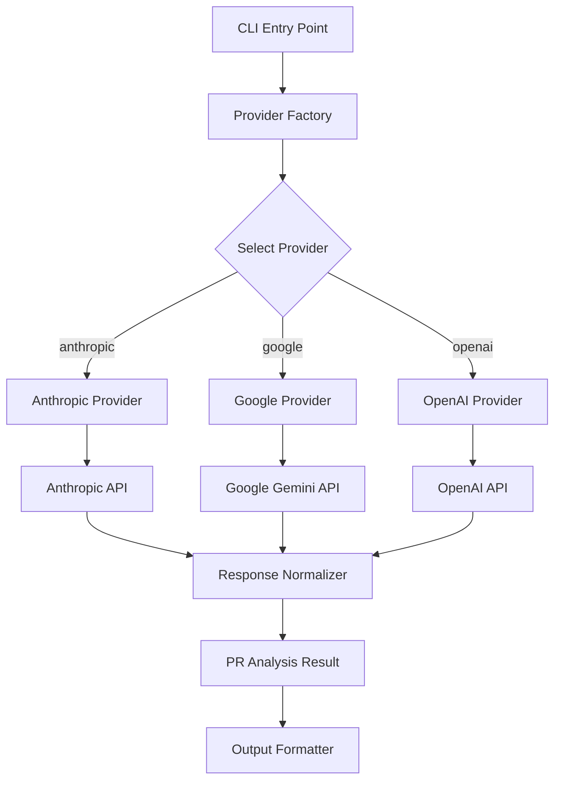
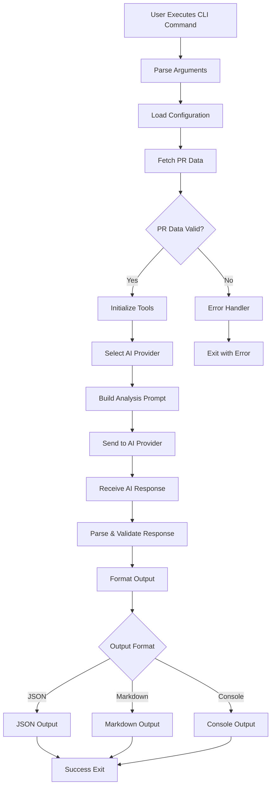
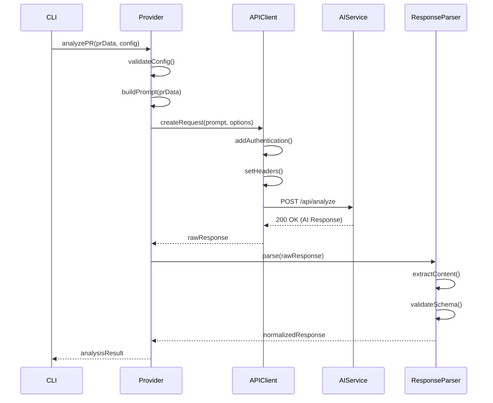
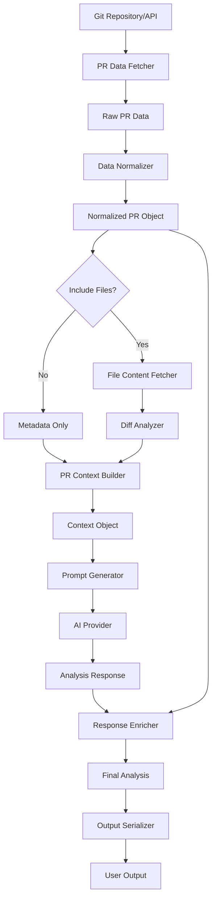
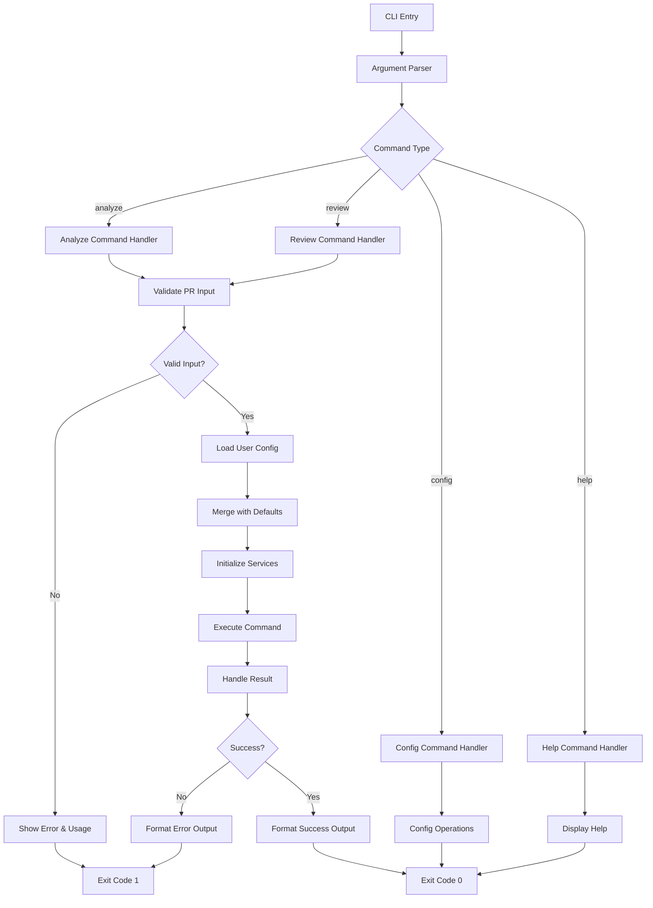
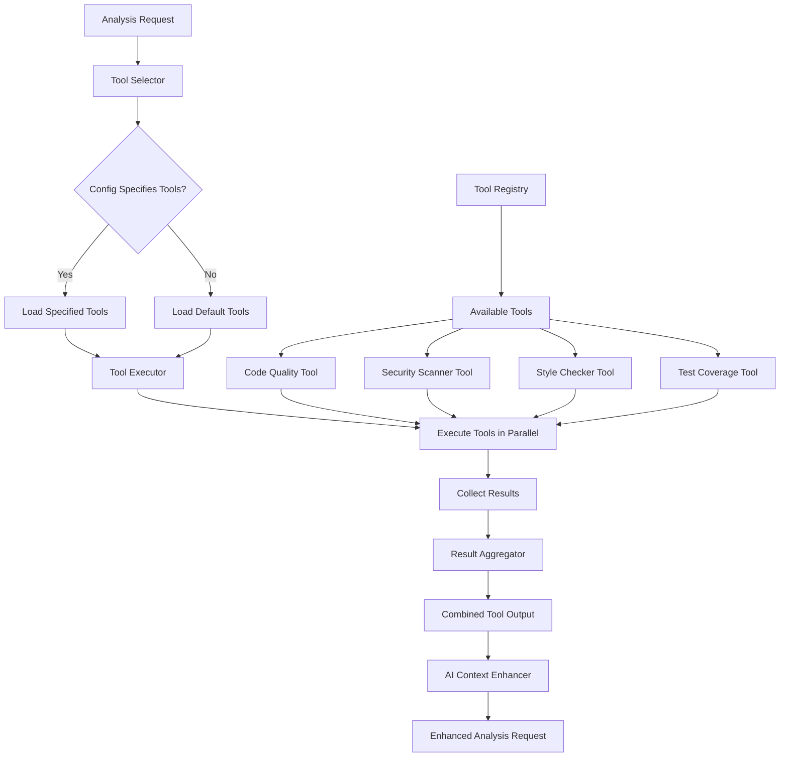
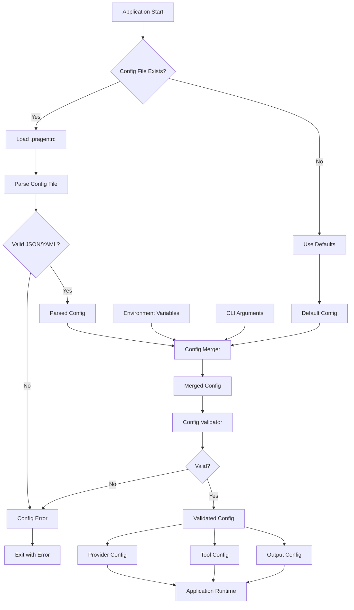
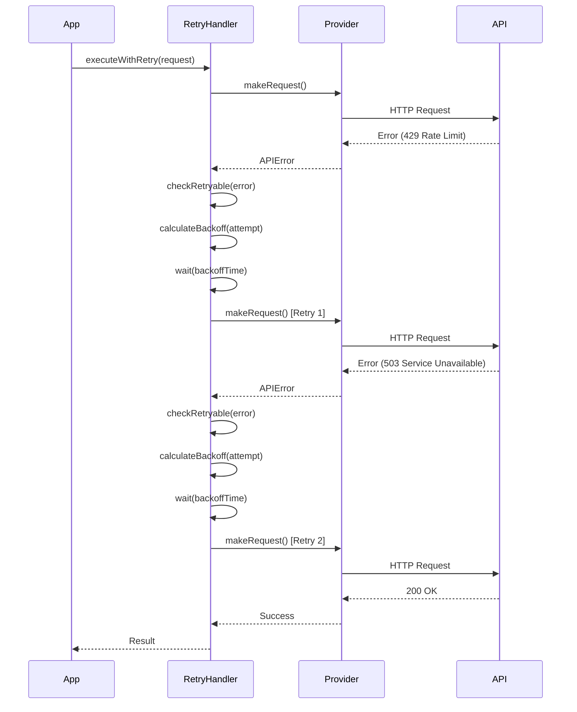
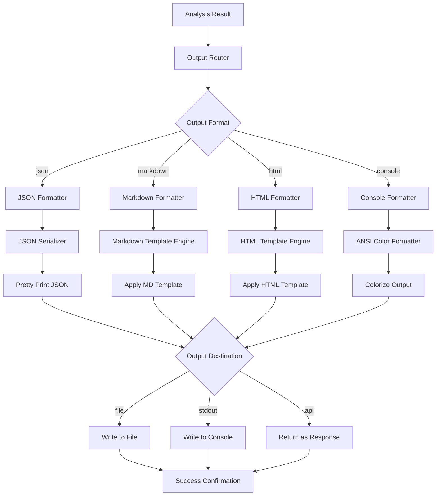
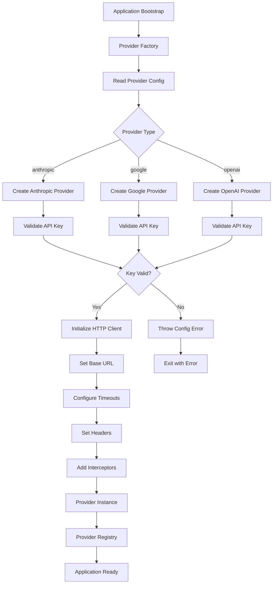

# Flow Visualizations

PR Agent is a CLI-based tool that analyzes pull requests using multiple AI providers (Anthropic, Google, OpenAI). The system features a provider abstraction pattern, CLI-driven workflows, and tool-based PR analysis capabilities. Key flows include AI provider selection, PR analysis processing, and CLI command execution.

## Identified Flows

### AI Provider Architecture

**Type**: component-flow

Shows how the system abstracts multiple AI providers through a unified interface and delegates requests to specific implementations

#### Diagram

> 💡 **Tip**: View this diagram with a Mermaid renderer:
> - VS Code: Install "Markdown Preview Mermaid Support" extension
> - GitHub/GitLab: Automatic rendering in markdown preview
> - Online: Copy to [mermaid.live](https://mermaid.live)

📊 Click to view component-flow diagram

#### Key Insights

- Provider pattern enables easy addition of new AI services without changing core logic
- Response normalization ensures consistent output format regardless of provider
- Factory pattern centralizes provider instantiation and configuration
- Each provider encapsulates API-specific authentication and request formatting

### PR Analysis Workflow

**Type**: process-flow

End-to-end process of analyzing a pull request from CLI invocation to result output

#### Diagram

> 💡 **Tip**: View this diagram with a Mermaid renderer:
> - VS Code: Install "Markdown Preview Mermaid Support" extension
> - GitHub/GitLab: Automatic rendering in markdown preview
> - Online: Copy to [mermaid.live](https://mermaid.live)

📊 Click to view process-flow diagram

#### Key Insights

- Multi-stage validation ensures data integrity before expensive AI calls
- Tool initialization happens after PR data validation to optimize performance
- Multiple output formats support different integration scenarios
- Error handling is centralized for consistent user experience
- Configuration loading is separate from execution for testability

### AI Provider Request/Response Cycle

**Type**: api-flow

Detailed flow of how requests are constructed, sent to AI providers, and responses are processed

#### Diagram

> 💡 **Tip**: View this diagram with a Mermaid renderer:
> - VS Code: Install "Markdown Preview Mermaid Support" extension
> - GitHub/GitLab: Automatic rendering in markdown preview
> - Online: Copy to [mermaid.live](https://mermaid.live)

📊 Click to view api-flow diagram

#### Key Insights

- Authentication is handled at the API client level for security
- Prompt building is provider-specific to optimize for each AI model
- Response parsing includes schema validation to catch API changes
- Synchronous flow simplifies error handling and debugging
- Configuration validation happens early to fail fast

### PR Data Processing Pipeline

**Type**: data-flow

How pull request data flows from source through analysis to final output

#### Diagram

> 💡 **Tip**: View this diagram with a Mermaid renderer:
> - VS Code: Install "Markdown Preview Mermaid Support" extension
> - GitHub/GitLab: Automatic rendering in markdown preview
> - Online: Copy to [mermaid.live](https://mermaid.live)

📊 Click to view data-flow diagram

#### Key Insights

- Data normalization early in pipeline ensures consistent processing
- Conditional file fetching optimizes performance for metadata-only analysis
- Diff analysis provides granular change context to AI models
- Response enrichment combines AI output with original PR data
- Separation of fetching and processing enables caching strategies
- Context building aggregates multiple data sources into unified structure

### CLI Command Execution Flow

**Type**: process-flow

How CLI commands are parsed, validated, and routed to appropriate handlers

#### Diagram

> 💡 **Tip**: View this diagram with a Mermaid renderer:
> - VS Code: Install "Markdown Preview Mermaid Support" extension
> - GitHub/GitLab: Automatic rendering in markdown preview
> - Online: Copy to [mermaid.live](https://mermaid.live)

📊 Click to view process-flow diagram

#### Key Insights

- Command routing happens early to minimize unnecessary processing
- Configuration merging follows precedence: CLI args > user config > defaults
- Service initialization is deferred until command validation passes
- Consistent error handling across all command types
- Help and config commands bypass heavy initialization for speed
- Exit codes follow Unix conventions for scripting integration

### Tool System Integration

**Type**: component-flow

How analysis tools are registered, selected, and applied during PR analysis

#### Diagram

> 💡 **Tip**: View this diagram with a Mermaid renderer:
> - VS Code: Install "Markdown Preview Mermaid Support" extension
> - GitHub/GitLab: Automatic rendering in markdown preview
> - Online: Copy to [mermaid.live](https://mermaid.live)

📊 Click to view component-flow diagram

#### Key Insights

- Tool registry pattern allows dynamic tool discovery and loading
- Parallel execution of tools improves analysis performance
- Tool results enhance AI prompts with structured data
- Configuration-driven tool selection enables customization
- Result aggregation normalizes output from different tool types
- Tools are loosely coupled to core analysis logic

### Configuration Management Flow

**Type**: data-flow

How configuration is loaded, merged, and applied throughout the application

#### Diagram

> 💡 **Tip**: View this diagram with a Mermaid renderer:
> - VS Code: Install "Markdown Preview Mermaid Support" extension
> - GitHub/GitLab: Automatic rendering in markdown preview
> - Online: Copy to [mermaid.live](https://mermaid.live)

📊 Click to view data-flow diagram

#### Key Insights

- Configuration precedence: CLI args > env vars > config file > defaults
- Validation happens after merging to catch conflicts
- Config is split into domain-specific sections for modularity
- File format flexibility (JSON/YAML) improves user experience
- Invalid configuration fails fast before expensive operations
- Environment variables enable CI/CD integration without file changes

### Error Handling and Retry Logic

**Type**: api-flow

How the system handles API failures, implements retries, and manages error states

#### Diagram

> 💡 **Tip**: View this diagram with a Mermaid renderer:
> - VS Code: Install "Markdown Preview Mermaid Support" extension
> - GitHub/GitLab: Automatic rendering in markdown preview
> - Online: Copy to [mermaid.live](https://mermaid.live)

📊 Click to view api-flow diagram

#### Key Insights

- Exponential backoff prevents overwhelming failing services
- Retry logic distinguishes between transient and permanent errors
- Rate limit errors trigger longer backoff periods
- Maximum retry attempts prevent infinite loops
- Error context is preserved through retry cycles for debugging
- Successful retries are logged for monitoring and alerting

### Output Formatting Pipeline

**Type**: process-flow

How analysis results are transformed into different output formats based on user preferences

#### Diagram

> 💡 **Tip**: View this diagram with a Mermaid renderer:
> - VS Code: Install "Markdown Preview Mermaid Support" extension
> - GitHub/GitLab: Automatic rendering in markdown preview
> - Online: Copy to [mermaid.live](https://mermaid.live)

📊 Click to view process-flow diagram

#### Key Insights

- Format selection happens early to avoid unnecessary processing
- Template engines enable customizable output layouts
- Console output includes ANSI colors for better readability
- JSON output is pretty-printed by default for human consumption
- Output destination is independent of format for flexibility
- All formatters implement common interface for consistency

### Provider Factory and Initialization

**Type**: component-flow

How AI providers are instantiated, configured, and made available to the application

#### Diagram

> 💡 **Tip**: View this diagram with a Mermaid renderer:
> - VS Code: Install "Markdown Preview Mermaid Support" extension
> - GitHub/GitLab: Automatic rendering in markdown preview
> - Online: Copy to [mermaid.live](https://mermaid.live)

📊 Click to view component-flow diagram

#### Key Insights

- Factory pattern centralizes provider creation logic
- API key validation happens at initialization to fail fast
- HTTP client configuration is provider-specific
- Interceptors enable cross-cutting concerns like logging and retry
- Provider registry enables runtime provider switching
- Initialization errors prevent application startup with invalid config

## Warnings

- ⚠️ Actual implementation details may vary - diagrams are based on common patterns for this type of application
- ⚠️ Authentication flows are simplified as no explicit auth controllers were found
- ⚠️ Some flows assume standard practices for CLI tools and AI provider integrations
- ⚠️ Database/repository flows are minimal as no repository files were detected
- ⚠️ Middleware chains are inferred from typical API flow patterns
- ⚠️ Specific tool implementations are abstracted as the tool system appears extensible
- ⚠️ Error handling flows represent best practices that may need verification in actual code
- ⚠️ Configuration file formats and locations are assumed based on common conventions

---

[← Back to Index](./index.md) | [← Previous: Patterns](./patterns.md) | [Next: Schema Documentation →](./schemas.md)
