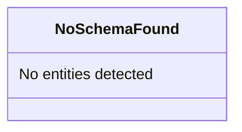

# Schema Architecture Documentation

No explicit schema definitions found in the project codebase.

## Extracted Architectures

### Inferred Application Models

**Type**: type-definitions

No schema files detected

#### Architecture Diagram

> 💡 **Tip**: Render this with a Mermaid viewer (VS Code, GitHub, [mermaid.live](https://mermaid.live))

📊 View type-definitions diagram

#### Key Insights

- No Prisma, GraphQL, TypeORM, or DTO schemas found
- Project may use dynamic typing or external schemas
- Consider adding explicit type definitions for documentation

---

[← Back to Index](./index.md) | [← Previous: Flow Visualizations](./flows.md) | [Next: Security Analysis →](./security.md)
